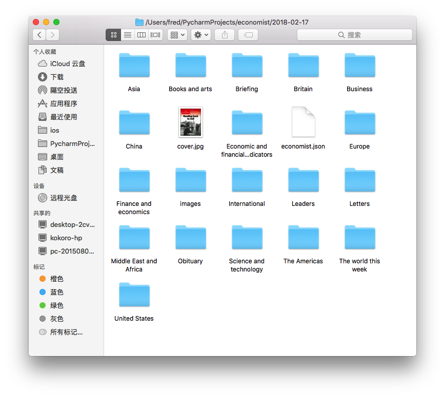
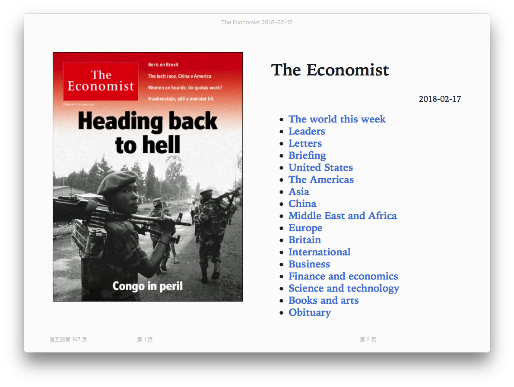

# ScrapyEconomist [](https://github.com/fredliu168/scrapy_economist_articles) [](https://github.com/fredliu168/scrapy_economist_articles/fork) 

# 自动抓取经济学人文章和期刊


> 更新

> 2018.2.24 新增支持文章内部图片抓取

> 2018.2.23 新增epub_gen.py 支持把生成的markdown印刷版转成epub电子书格式

> 2018.2.22 新增scrapy_sort_by_type.py 支持印刷版本按类型分类存储,并生成目录json信息,方便转化成电子书


听说程序员必须学好英语,如果ChinaDaily已经满足不了你,那快来试试经济学人,经济学人是学习英语的最好的帮手,但是去网站上看了下,各种文章需要订阅后才能看,于是稍微研究了下,有需要的同学的可以自己去抓取下.

本代码使用Python3+BeautifulSoup自动下载经济学人期刊文章,保存成Markdown格式,可以使用MWeb等Markdown工具编辑、阅读或者转换成word,pdf格式
 
 > 经济学人:
 
《经济学人》是一份由伦敦经济学人报纸有限公司出版的杂志，创办于1843年9月，创办人詹姆士·威尔逊。杂志的大多数文章写得机智，幽默，有力度，严肃又不失诙谐，并且注重于如何在最小的篇幅内告诉读者最多的信息。该杂志又以发明巨无霸指数闻名，是社会精英必不可少的读物。该杂志英文电子版可通过移动App、网站或者有声版阅读每周完整内容。

杂志主要关注政治和商业方面的新闻，但是每期也有一两篇针对科技和艺术的报导，以及一些书评。杂志中所有文章都不署名，而且往往带有鲜明的立场，但又处处用事实说话。主编们认为：写出了什么东西，比出自谁的手笔更重要。从2012年1月28日的那一期杂志开始《经济学人》杂志开辟了中国专栏，为有关中国的文章提供更多的版面。


## 抓取期刊使用方法(scrapy_main.py):

> 最新期刊下载地址:

>https://github.com/fredliu168/scrapy_economist_articles/releases

> 运行环境: Python3 

执行如下命令安装依赖：

```python
pip install -r requirements.txt
``` 

> 生成requirements.txt 
```python
pip freeze > requirements.txt
```


> 设置默认保存路径: SAVE_DIR = '/Users/fred/PycharmProjects/economist/'


### 一.获取期刊

传入期刊日期,可以自动下载该期刊,期刊查询地址:

> https://www.economist.com/printedition/covers

```python

get_print_edition('2018-02-03')

```

### 二.根据URL获取单篇文章


```python
# article_url 文章网址
# save_dir 保存路径,目录下需要创建图片文件夹,名称为images
article_url='https://www.economist.com/news/science-and-technology/21736394-it-all-depends-which-palaeontologist-you-ask-strange-fossil-spider-or-maybe-not'
save_dir = '/Users/fred/PycharmProjects/economist/'

get_article_content(article_url,save_dir)

```

### 三.获取topics文章

可以根据不同topics的url获取文章,自动保存到设置的默认目录下:

```python
# https://www.economist.com/sections/china
get_tpoics_articles('https://www.economist.com/latest-updates')

```


## 抓取期刊并转成ebup电子书使用方法(scrapy_sort_by_type.py,epub_gen.py):

### 一.先使用scrapy_sort_by_type下载电子期刊

```python
 get_print_edition('2018-02-17')
```

下载后按照类型进行分类,文章格式为markdown,同时生成economist.json,保存生成的文章信息



### 二.使用epub_gen生成电子书
```python

   makeEpub('2018-02-17')
   
```
电子书刊如下展示:




欢迎关注我的公众号,有问题可以留言:


---

# 下载的文章实例

# The Falcon Heavy’s successful flight is another vindication for Elon Musk

##### And another headache for SpaceX’s competitors


> Science and technology | Feb 5th 2018

IT WAS not the most powerful launch ever seen at the Kennedy Space Cemtre’s Pad 39A; almost half a century ago the Apollo programme’s mighty Saturn V’s made use of it. But if the Falcon Heavy that took off from 39A on February 6th could boast only half the thrust of those bygone giants, its successful maiden voyage still proved it the most powerful rocket in the world today, as well as the most technologically advanced.

Elon Musk, the founder of SpaceX, the firm which built the Falcon Heavy, had been frank about the possibility that the launch might fail, possibly spectacularly. The prospect of fireworks helped to entice the biggest crowd of spectators at Cape Canaveral since the heyday of the Space Shuttle, and an audience of half a million to a live webcast.

...