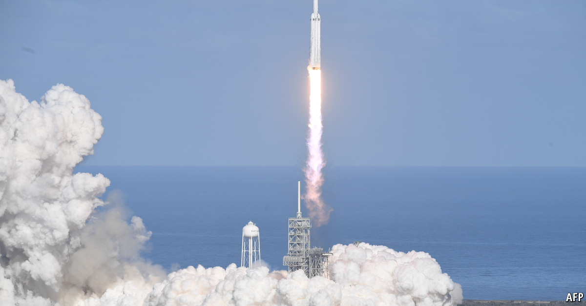

# ScrapyEconomist [](https://github.com/fredliu168/scrapy_economist_articles) [](https://github.com/fredliu168/scrapy_economist_articles/fork) 

# 自动抓取经济学人文章和期刊


听说程序员必须学好英语,如果chinadaily已经满足不了你,那快来试试经济学人,经济学人是学习英语的最好的帮手,但是去网站上看了下,各种文章需要订阅后才能看,于是稍微研究了下,有需要的同学的可以自己去抓取下.

本代码使用Python3+BeautifulSoup自动下载经济学人期刊文章,保存成Markdown格式,可以使用MWeb等Markdown工具编辑、阅读或者转换成word,pdf格式
 

## 使用方法:

> 最新期刊下载地址:

>https://github.com/fredliu168/scrapy_economist_articles/releases

> 运行环境: Python3 

执行如下命令安装依赖：

```python
pip install -r requirements.txt
``` 

> 设置默认保存路径: SAVE_DIR = '/Users/fred/PycharmProjects/economist/'


### 一.获取期刊

传入期刊日期,可以自动下载该期刊,期刊查询地址:

> https://www.economist.com/printedition/covers

```python

get_print_edition('2018-02-03')

```

### 二.根据URL获取单篇文章


```python
# article_url 文章网址
# save_dir 保存路径,目录下需要创建图片文件夹,名称为images
article_url='https://www.economist.com/news/science-and-technology/21736394-it-all-depends-which-palaeontologist-you-ask-strange-fossil-spider-or-maybe-not'
save_dir = '/Users/fred/PycharmProjects/economist/'

get_article_content(article_url,save_dir)

```

### 三.获取topics文章

可以根据不同topics的url获取文章,自动保存到设置的默认目录下:

```python
# https://www.economist.com/sections/china
get_tpoics_articles('https://www.economist.com/latest-updates')

```

欢迎关注我的公众号,有问题可以留言:


---

# 下载的文章实例

# The Falcon Heavy’s successful flight is another vindication for Elon Musk

##### And another headache for SpaceX’s competitors



> Science and technology | Feb 5th 2018

IT WAS not the most powerful launch ever seen at the Kennedy Space Cemtre’s Pad 39A; almost half a century ago the Apollo programme’s mighty Saturn V’s made use of it. But if the Falcon Heavy that took off from 39A on February 6th could boast only half the thrust of those bygone giants, its successful maiden voyage still proved it the most powerful rocket in the world today, as well as the most technologically advanced.

Elon Musk, the founder of SpaceX, the firm which built the Falcon Heavy, had been frank about the possibility that the launch might fail, possibly spectacularly. The prospect of fireworks helped to entice the biggest crowd of spectators at Cape Canaveral since the heyday of the Space Shuttle, and an audience of half a million to a live webcast.

...